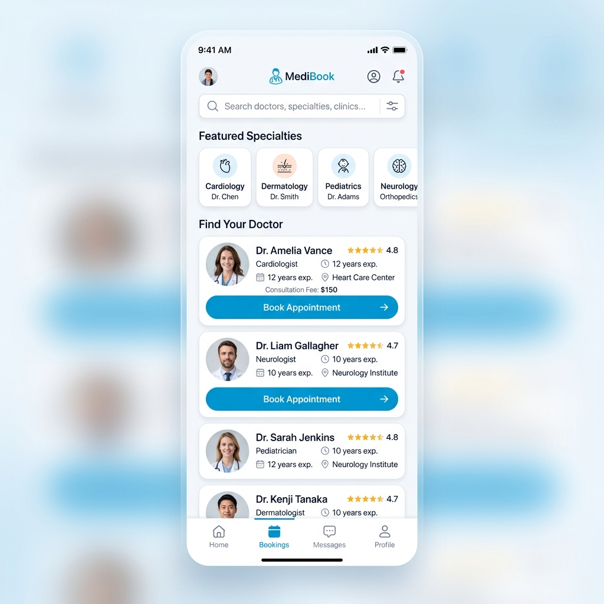
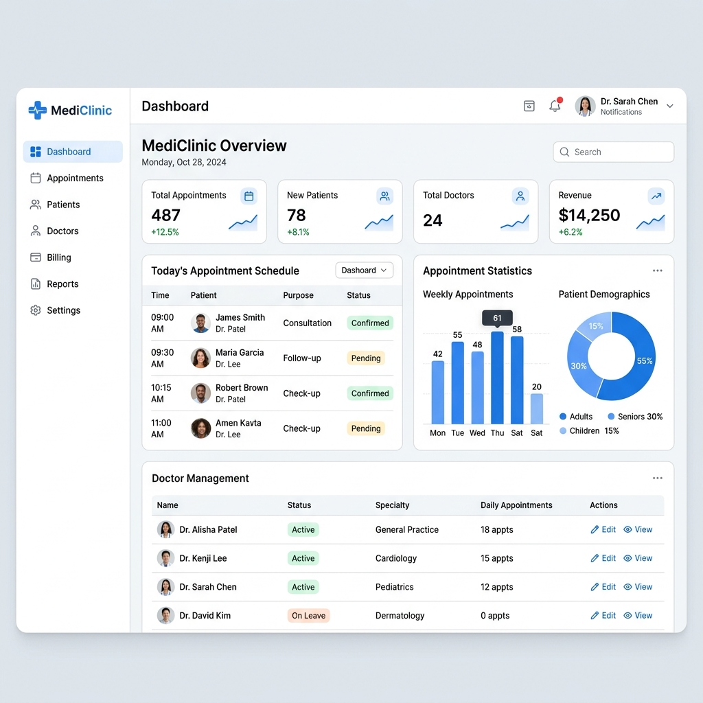
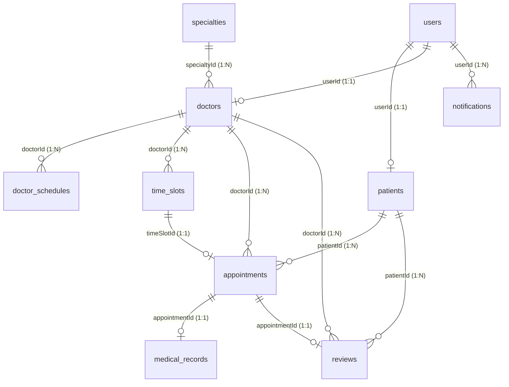

## **Ứng dụng đặt lịch khám bệnh Medical Booking**

- Mô tả: Ứng dụng đặt lịch khám bệnh trực tuyến đa nền tảng y tế số, giúp tối ưu hóa quy trình kết nối giữa bệnh nhân, bác sĩ và nhà quản trị phòng khám/bệnh viện. Sử dụng các công nghệ hiện đại: Node.js (Express), React (Vite), React Native (Expo), Prisma ORM và cơ sở dữ liệu PostgreSQL.

## **Các yêu cầu nghiệp vụ:**
* Đối với bệnh nhân (Người dùng Mobile App):
1. Người dùng được đăng ký tài khoản cá nhân, cập nhật hồ sơ y tế đầy đủ (họ tên, ngày sinh, giới tính, số điện thoại, địa chỉ, mã BHYT, nhóm máu, tiền sử dị ứng, tiền sử bệnh án).
2. Hệ thống hỗ trợ tìm kiếm và lọc danh sách bác sĩ trực tuyến theo chuyên khoa y tế, học hàm học vị hoặc mức độ đánh giá (Rating) từ bệnh nhân trước đó.
3. Người dùng dễ dàng tra cứu lịch khám trống của bác sĩ (Available Time Slots), thực hiện đặt lịch khám nhanh chóng bằng cách chọn ngày giờ rảnh và nhập mô tả triệu chứng ban đầu.
4. Quản lý danh sách các lịch hẹn khám cá nhân theo thời gian và trạng thái (Đang chờ duyệt, Đã xác nhận, Đã hủy, Đã hoàn tất).
5. Nhận kết quả khám bệnh, đơn thuốc y khoa và ghi chú tái khám trực quan ngay sau khi cuộc hẹn khám hoàn thành.
6. Cho phép đánh giá, phản hồi mức độ hài lòng (xếp hạng từ 1-5 sao và bình luận chi tiết) dành cho bác sĩ sau khi cuộc khám bệnh kết thúc.
7. Nhận thông báo nhắc nhở lịch hẹn, cập nhật trạng thái cuộc hẹn trong thời gian thực nhờ công nghệ Socket.io.

* Đối với bác sĩ (Giao diện Web Portal):
1. Đăng nhập hệ thống, cập nhật hồ sơ chuyên môn cá nhân (bằng cấp học vị, mô tả kinh nghiệm, mức phí khám bệnh trực tiếp).
2. Thiết lập lịch trực cố định hàng tuần (Doctor Schedule) theo ngày trong tuần và khoảng thời gian để hệ thống tự động sinh ra các Time Slots khám rảnh cho bệnh nhân đăng ký.
3. Xem danh sách lịch hẹn khám của bệnh nhân, chủ động xác nhận (Confirm) hoặc từ chối/hủy lịch hẹn kèm theo lý do từ chối rõ ràng.
4. Thực hiện khám bệnh trực quan, lập Hồ sơ bệnh án điện tử (Medical Record) cho bệnh nhân bao gồm chẩn đoán, kê đơn thuốc và ngày hẹn tái khám.
5. Xem lại lịch sử các đánh giá, phản hồi chi tiết từ bệnh nhân để nâng cao trải nghiệm y khoa.
6. Theo dõi bảng điều khiển số liệu thống kê Dashboard cá nhân về tổng số ca khám và doanh thu thực tế.

* Đối với quản trị viên (System Admin Web Portal):
1. Quản lý danh mục tài khoản toàn bộ người dùng trong hệ thống (Bệnh nhân, Bác sĩ, Quản trị viên), có quyền kích hoạt hoặc khóa tài khoản khi phát hiện dấu hiệu vi phạm.
2. Quản lý danh mục Chuyên khoa y tế (tạo mới chuyên khoa, chỉnh sửa thông tin mô tả, cập nhật hình ảnh biểu tượng chuyên khoa).
3. Duyệt danh sách bác sĩ, gán bác sĩ trực thuộc các chuyên khoa phù hợp để hỗ trợ bệnh nhân tìm kiếm.
4. Giám sát toàn bộ luồng lịch hẹn khám bệnh, hồ sơ bệnh án, các thông báo hệ thống và lịch sử đánh giá bác sĩ toàn viện.
5. Theo dõi biểu đồ Dashboard thống kê tổng quan sức khỏe hệ thống y tế thời gian thực.

## **Sơ đồ ERD (Entity-Relationship Diagram)**

1. **Quan hệ 1:1 giữa User và Patient/Doctor:** Mỗi tài khoản trong hệ thống (`users`) chỉ liên kết với tối đa một bản ghi chi tiết bệnh nhân (`patients`) hoặc bác sĩ (`doctors`) thông qua `userId`, giúp bảo mật thông tin đăng nhập và tách biệt logic nghiệp vụ.
2. **Quan hệ 1:N giữa Specialty và Doctor:** Một chuyên khoa y tế (`specialties`) chứa nhiều bác sĩ làm việc trực thuộc, nhưng mỗi bác sĩ chỉ thuộc về duy nhất một chuyên khoa y khoa thông qua `specialtyId`.
3. **Quan hệ 1:N giữa Doctor và DoctorSchedule:** Một bác sĩ có thể thiết lập cấu hình nhiều ca trực cố định (`doctor_schedules`) cho các ngày trong tuần (Thứ Hai đến Chủ Nhật).
4. **Quan hệ 1:N giữa Doctor và TimeSlot:** Bác sĩ quản lý nhiều khung giờ khám cụ thể theo ngày thực tế (`time_slots`) để bệnh nhân có thể đăng ký đặt chỗ trực tuyến.
5. **Quan hệ 1:N giữa Patient/Doctor và Appointment:** Bệnh nhân và bác sĩ tương tác thông qua nhiều cuộc hẹn y tế (`appointments`). Một bệnh nhân được đặt nhiều cuộc hẹn và một bác sĩ tiếp nhận nhiều ca khám khác nhau.
6. **Quan hệ 1:1 giữa Appointment và TimeSlot:** Mỗi cuộc hẹn khám bệnh liên kết duy nhất với một khung giờ khám. Khung giờ khi đã có lịch hẹn được xác nhận sẽ tự động chuyển trạng thái `BOOKED` để chống trùng lịch khám.
7. **Quan hệ 1:1 giữa Appointment và MedicalRecord:** Sau khi bác sĩ hoàn thành quy trình khám chữa bệnh (`COMPLETED`), một kết quả khám bệnh (`medical_records`) ghi nhận chẩn đoán và đơn thuốc y khoa sẽ được tạo lập duy nhất cho cuộc hẹn đó.
8. **Quan hệ 1:1 giữa Appointment và Review:** Mỗi cuộc khám bệnh hoàn thành chỉ được phép gửi tối đa một đánh giá phản hồi (`reviews`) từ bệnh nhân đặt lịch để đảm bảo tính xác thực.
9. **Quan hệ 1:N giữa User và Notification:** Mỗi người dùng trong hệ thống có thể nhận được nhiều thông báo nhắc nhở (`notifications`) phục vụ cập nhật tiến trình y tế thời gian thực.
