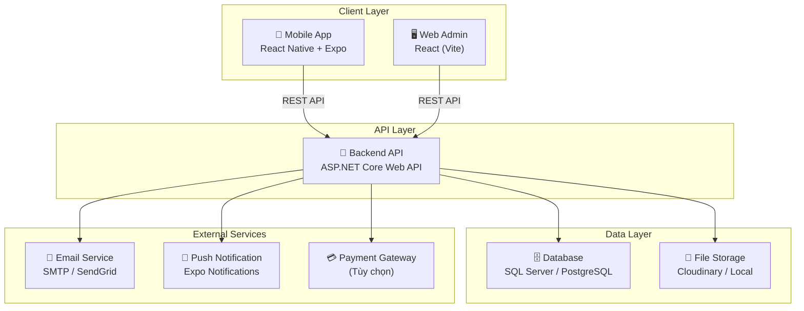
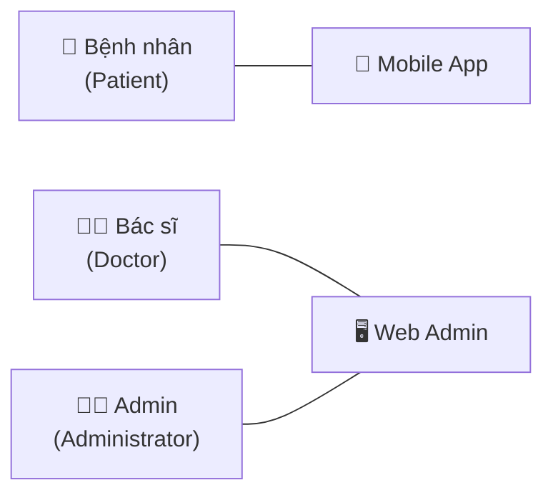
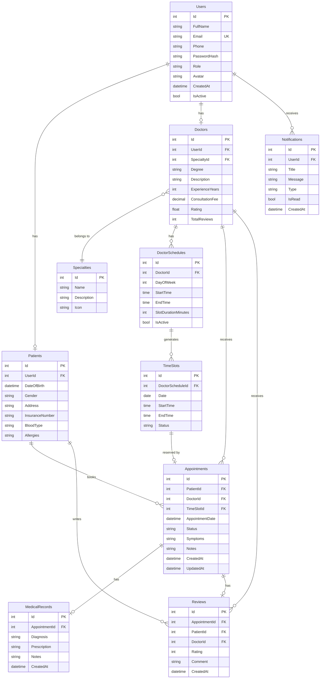
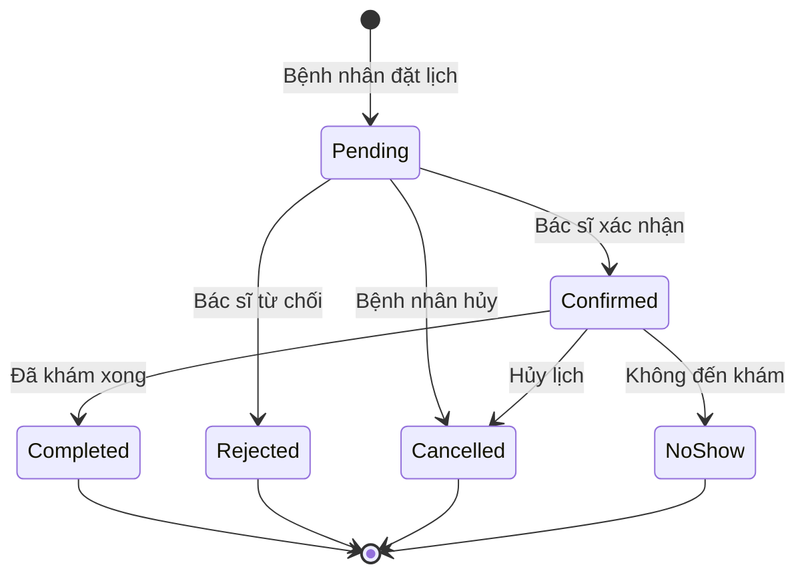
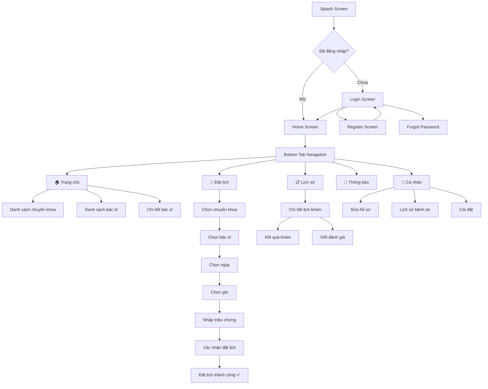
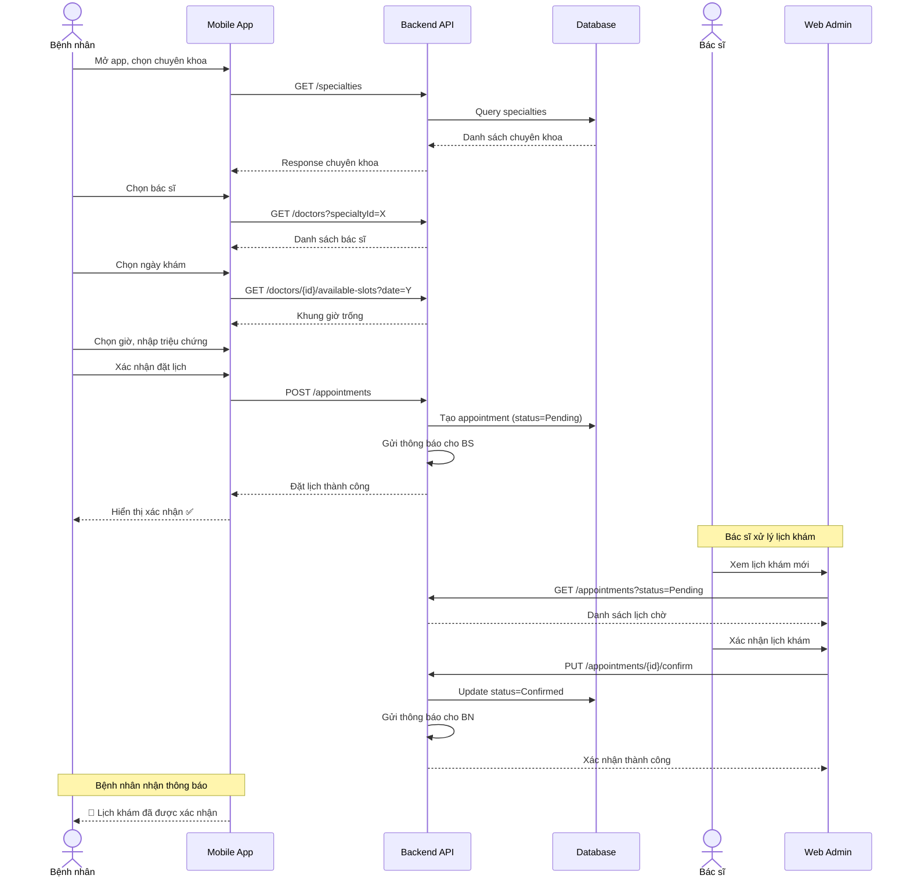
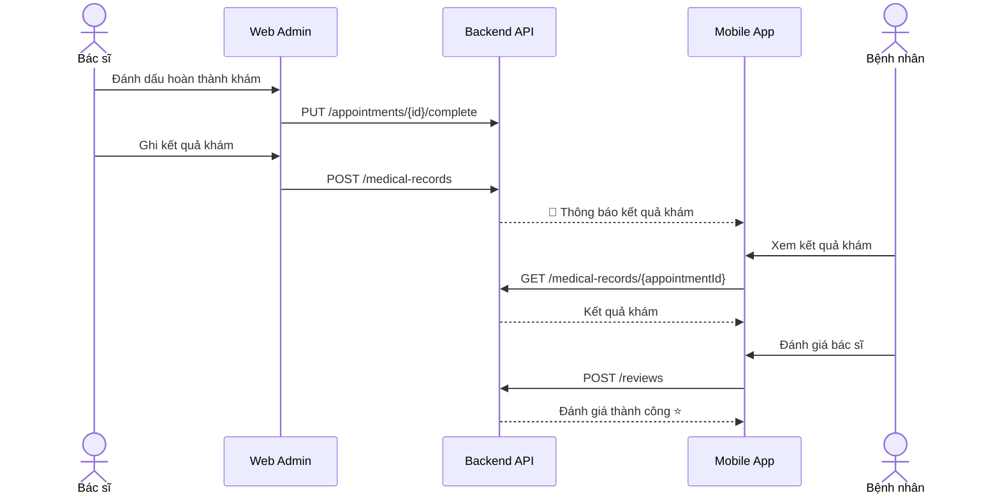
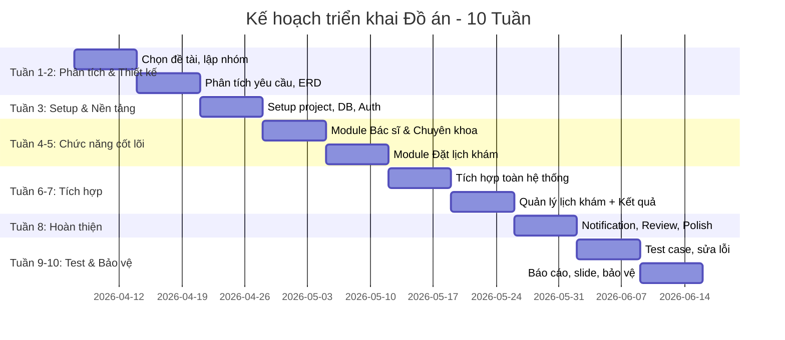

# ỨNG DỤNG ĐẶT LỊCH KHÁM BỆNH - KẾ HOẠCH TRIỂN KHAI ĐỒ ÁN

## 1. Tổng quan đề tài

**Tên đề tài:** Ứng dụng Đặt Lịch Khám Bệnh (Medical Appointment Booking App)

**Mô tả:** Xây dựng ứng dụng đa nền tảng cho phép bệnh nhân đặt lịch khám bệnh trực tuyến, quản lý hồ sơ sức khỏe cá nhân, và tương tác với bác sĩ/phòng khám. Hệ thống bao gồm ứng dụng mobile cho bệnh nhân, trang web quản trị cho admin/bác sĩ, và backend API.

**Công nghệ bắt buộc:**
- **Mobile App:** React Native + Expo
- **Backend + Web Admin:** Tự chọn (đề xuất bên dưới)

---

## 2. Kiến trúc hệ thống tổng thể



---

## 3. Công nghệ đề xuất chi tiết

### 3.1. Mobile App (Bệnh nhân)
| Thành phần | Công nghệ | Lý do |
|---|---|---|
| Framework | **React Native + Expo (SDK 52+)** | Bắt buộc theo yêu cầu đề tài |
| Navigation | **Expo Router** | File-based routing, tích hợp tốt với Expo |
| State Management | **Zustand** hoặc **React Context** | Nhẹ, dễ học, phù hợp quy mô đồ án |
| HTTP Client | **Axios** | Tính năng interceptor, xử lý lỗi tốt |
| UI Components | **React Native Paper** hoặc **NativeWind** | Material Design, đẹp sẵn |
| Form Validation | **React Hook Form + Yup/Zod** | Hiệu năng tốt, validation mạnh |
| Calendar | **react-native-calendars** | Hiển thị lịch đặt khám |
| Image Picker | **expo-image-picker** | Upload ảnh hồ sơ |
| Secure Storage | **expo-secure-store** | Lưu token an toàn |
| Push Notification | **expo-notifications** | Thông báo lịch khám |

### 3.2. Backend API
| Thành phần | Công nghệ | Lý do |
|---|---|---|
| Framework | **Node.js + Express.js** | ✅ Đã chọn — cùng JS ecosystem với React Native |
| ORM | **Prisma** | Type-safe, migration tự động, DX tuyệt vời |
| Authentication | **JWT Bearer Token** | Stateless, phù hợp mobile |
| Database | **PostgreSQL** | ✅ Đã chọn — miễn phí, mạnh mẽ, hỗ trợ JSON |
| API Docs | **Swagger (swagger-jsdoc)** | Tự động sinh tài liệu API |
| Validation | **Joi / Zod** | Validate request body |
| File Upload | **Multer + Cloudinary** | Upload & lưu trữ ảnh |
| Email | **Nodemailer** | Gửi xác nhận đặt lịch |

### 3.3. Web Admin (Quản trị)
| Thành phần | Công nghệ | Lý do |
|---|---|---|
| Framework | **React (Vite)** | Cùng ecosystem với React Native |
| UI Library | **Ant Design** hoặc **MUI** | Component admin sẵn có, đẹp |
| Table/Data | **TanStack Table** | Quản lý bảng dữ liệu mạnh mẽ |
| Charts | **Recharts** | Thống kê trực quan |
| HTTP Client | **Axios** | Thống nhất với mobile |

---

## 4. Phân tích nghiệp vụ & Actors

### 4.1. Các Actor (Vai trò)



| Actor | Nền tảng | Mô tả |
|---|---|---|
| **Bệnh nhân** | Mobile App | Đăng ký, đăng nhập, đặt lịch khám, xem lịch sử, quản lý hồ sơ |
| **Bác sĩ** | Web Admin | Xem lịch khám, xác nhận/từ chối lịch, ghi kết quả khám |
| **Admin** | Web Admin | Quản lý toàn bộ hệ thống: người dùng, bác sĩ, chuyên khoa, thống kê |

### 4.2. Sơ đồ phân rã chức năng

```mermaid
graph TD
    ROOT["🏥 Ứng dụng Đặt Lịch Khám Bệnh"]
    
    ROOT --> AUTH["🔐 Quản lý Tài khoản"]
    ROOT --> BOOKING["📅 Đặt Lịch Khám"]
    ROOT --> DOCTOR["👨‍⚕️ Quản lý Bác sĩ"]
    ROOT --> PATIENT["👤 Hồ sơ Bệnh nhân"]
    ROOT --> ADMIN["⚙️ Quản trị Hệ thống"]
    ROOT --> NOTIFY["🔔 Thông báo"]
    
    AUTH --> A1["Đăng ký"]
    AUTH --> A2["Đăng nhập"]
    AUTH --> A3["Quên mật khẩu"]
    AUTH --> A4["Đổi mật khẩu"]
    AUTH --> A5["Phân quyền"]
    
    BOOKING --> B1["Tìm bác sĩ/chuyên khoa"]
    BOOKING --> B2["Chọn ngày & khung giờ"]
    BOOKING --> B3["Đặt lịch khám"]
    BOOKING --> B4["Hủy lịch khám"]
    BOOKING --> B5["Xem lịch sử khám"]
    BOOKING --> B6["Đánh giá sau khám"]
    
    DOCTOR --> D1["Danh sách bác sĩ"]
    DOCTOR --> D2["Thông tin chi tiết BS"]
    DOCTOR --> D3["Lịch làm việc BS"]
    DOCTOR --> D4["Xác nhận/Từ chối lịch"]
    DOCTOR --> D5["Ghi kết quả khám"]
    
    PATIENT --> P1["Thông tin cá nhân"]
    PATIENT --> P2["Lịch sử bệnh án"]
    PATIENT --> P3["Kết quả khám"]
    
    ADMIN --> AD1["Quản lý người dùng"]
    ADMIN --> AD2["Quản lý chuyên khoa"]
    ADMIN --> AD3["Quản lý bác sĩ"]
    ADMIN --> AD4["Thống kê báo cáo"]
    ADMIN --> AD5["Cấu hình hệ thống"]
    
    NOTIFY --> N1["Nhắc lịch khám"]
    NOTIFY --> N2["Xác nhận đặt lịch"]
    NOTIFY --> N3["Thông báo hủy lịch"]
```



---

## 5. Thiết kế Cơ sở dữ liệu

### 5.1. Sơ đồ ERD



### 5.2. Bảng trạng thái lịch khám (Appointment Status Flow)



---

## 6. Thiết kế API Endpoints

### 6.1. Authentication
| Method | Endpoint | Mô tả |
|---|---|---|
| POST | `/api/auth/register` | Đăng ký tài khoản |
| POST | `/api/auth/login` | Đăng nhập |
| POST | `/api/auth/refresh-token` | Làm mới token |
| POST | `/api/auth/forgot-password` | Gửi email quên mật khẩu |
| PUT | `/api/auth/change-password` | Đổi mật khẩu |

### 6.2. Patients
| Method | Endpoint | Mô tả |
|---|---|---|
| GET | `/api/patients/profile` | Xem hồ sơ bệnh nhân |
| PUT | `/api/patients/profile` | Cập nhật hồ sơ |
| GET | `/api/patients/medical-records` | Lịch sử bệnh án |

### 6.3. Doctors
| Method | Endpoint | Mô tả |
|---|---|---|
| GET | `/api/doctors` | Danh sách bác sĩ (search, filter) |
| GET | `/api/doctors/{id}` | Chi tiết bác sĩ |
| GET | `/api/doctors/{id}/schedules` | Lịch làm việc bác sĩ |
| GET | `/api/doctors/{id}/available-slots?date=` | Khung giờ trống theo ngày |
| GET | `/api/doctors/{id}/reviews` | Đánh giá của bác sĩ |

### 6.4. Specialties
| Method | Endpoint | Mô tả |
|---|---|---|
| GET | `/api/specialties` | Danh sách chuyên khoa |
| GET | `/api/specialties/{id}/doctors` | Bác sĩ theo chuyên khoa |

### 6.5. Appointments
| Method | Endpoint | Mô tả |
|---|---|---|
| POST | `/api/appointments` | Đặt lịch khám mới |
| GET | `/api/appointments` | Danh sách lịch khám (theo user) |
| GET | `/api/appointments/{id}` | Chi tiết lịch khám |
| PUT | `/api/appointments/{id}/cancel` | Hủy lịch khám |
| PUT | `/api/appointments/{id}/confirm` | Bác sĩ xác nhận |
| PUT | `/api/appointments/{id}/reject` | Bác sĩ từ chối |
| PUT | `/api/appointments/{id}/complete` | Hoàn thành khám |

### 6.6. Medical Records
| Method | Endpoint | Mô tả |
|---|---|---|
| POST | `/api/medical-records` | Tạo kết quả khám |
| GET | `/api/medical-records/{appointmentId}` | Xem kết quả khám |

### 6.7. Reviews
| Method | Endpoint | Mô tả |
|---|---|---|
| POST | `/api/reviews` | Đánh giá sau khám |
| GET | `/api/reviews/doctor/{doctorId}` | Đánh giá của BS |

### 6.8. Notifications
| Method | Endpoint | Mô tả |
|---|---|---|
| GET | `/api/notifications` | Danh sách thông báo |
| PUT | `/api/notifications/{id}/read` | Đánh dấu đã đọc |
| PUT | `/api/notifications/read-all` | Đọc tất cả |

### 6.9. Admin
| Method | Endpoint | Mô tả |
|---|---|---|
| GET | `/api/admin/dashboard` | Thống kê tổng quan |
| CRUD | `/api/admin/users` | Quản lý người dùng |
| CRUD | `/api/admin/doctors` | Quản lý bác sĩ |
| CRUD | `/api/admin/specialties` | Quản lý chuyên khoa |
| GET | `/api/admin/appointments` | Tất cả lịch khám |

---

## 7. Thiết kế Giao diện Mobile App

### 7.1. Cấu trúc màn hình (Screen Flow)



### 7.2. Danh sách màn hình chi tiết

| # | Màn hình | Mô tả | Thành phần chính |
|---|---|---|---|
| 1 | **Splash Screen** | Logo + loading | Logo, progress bar |
| 2 | **Onboarding** | Giới thiệu app (3 slides) | Swiper, illustration |
| 3 | **Login** | Đăng nhập | Email, password, nút login |
| 4 | **Register** | Đăng ký | Form đăng ký với validation |
| 5 | **Forgot Password** | Quên mật khẩu | Email input, gửi OTP |
| 6 | **Home** | Trang chủ | Banner, chuyên khoa, bác sĩ nổi bật, lịch khám sắp tới |
| 7 | **Specialty List** | DS chuyên khoa | Grid cards với icon |
| 8 | **Doctor List** | DS bác sĩ | Filter, search, card bác sĩ |
| 9 | **Doctor Detail** | Chi tiết bác sĩ | Avatar, thông tin, lịch, đánh giá, nút đặt lịch |
| 10 | **Booking Flow** | Đặt lịch (multi-step) | Stepper: Chuyên khoa → BS → Ngày → Giờ → Xác nhận |
| 11 | **Booking Success** | Đặt thành công | Animation confetti, thông tin lịch |
| 12 | **Appointment List** | Lịch sử/sắp tới | Tab upcoming/past, card lịch khám |
| 13 | **Appointment Detail** | Chi tiết lịch khám | Info, trạng thái, nút hủy/đánh giá |
| 14 | **Medical Record** | Kết quả khám | Chẩn đoán, đơn thuốc, ghi chú BS |
| 15 | **Write Review** | Đánh giá BS | Star rating, comment |
| 16 | **Notification List** | Thông báo | List with badges |
| 17 | **Profile** | Hồ sơ cá nhân | Avatar, thông tin, menu settings |
| 18 | **Edit Profile** | Sửa hồ sơ | Form edit với image picker |
| 19 | **Settings** | Cài đặt | Đổi MK, ngôn ngữ, about, logout |

### 7.3. Cấu trúc thư mục Mobile App (Expo Router)

```
medical-booking-app/
├── app/
│   ├── _layout.tsx              # Root layout
│   ├── index.tsx                # Splash/Entry
│   ├── (auth)/
│   │   ├── _layout.tsx
│   │   ├── login.tsx
│   │   ├── register.tsx
│   │   └── forgot-password.tsx
│   ├── (tabs)/
│   │   ├── _layout.tsx          # Bottom tabs
│   │   ├── index.tsx            # Home
│   │   ├── booking.tsx          # Booking flow
│   │   ├── history.tsx          # Appointment history
│   │   ├── notifications.tsx    # Notifications
│   │   └── profile.tsx          # Profile
│   ├── doctor/
│   │   ├── [id].tsx             # Doctor detail
│   │   └── list.tsx             # Doctor list
│   ├── specialty/
│   │   └── [id].tsx             # Specialty doctors
│   ├── appointment/
│   │   ├── [id].tsx             # Appointment detail
│   │   ├── booking.tsx          # Booking steps
│   │   └── success.tsx          # Booking success
│   ├── medical-record/
│   │   └── [id].tsx
│   └── settings/
│       ├── edit-profile.tsx
│       └── change-password.tsx
├── components/
│   ├── common/                  # Button, Input, Card, Modal...
│   ├── home/                    # HomeHeader, SpecialtyGrid...
│   ├── doctor/                  # DoctorCard, DoctorInfo...
│   ├── booking/                 # StepIndicator, TimeSlotPicker...
│   └── appointment/             # AppointmentCard, StatusBadge...
├── hooks/
│   ├── useAuth.ts
│   ├── useAppointments.ts
│   └── useDoctors.ts
├── services/
│   ├── api.ts                   # Axios instance
│   ├── authService.ts
│   ├── doctorService.ts
│   ├── appointmentService.ts
│   └── notificationService.ts
├── stores/
│   ├── authStore.ts             # Zustand auth store
│   └── bookingStore.ts
├── constants/
│   ├── colors.ts
│   ├── fonts.ts
│   └── config.ts
├── types/
│   └── index.ts                 # TypeScript interfaces
├── utils/
│   ├── formatDate.ts
│   ├── validators.ts
│   └── helpers.ts
└── assets/
    ├── images/
    ├── icons/
    └── fonts/
```

---

## 8. Thiết kế Web Admin

### 8.1. Chức năng chính

| Module | Chức năng |
|---|---|
| **Dashboard** | Thống kê tổng quan: số lịch khám hôm nay, tổng bệnh nhân, tổng bác sĩ, biểu đồ |
| **Quản lý Chuyên khoa** | CRUD chuyên khoa (tên, mô tả, icon) |
| **Quản lý Bác sĩ** | CRUD bác sĩ, gán chuyên khoa, quản lý lịch làm việc |
| **Quản lý Lịch khám** | Xem tất cả lịch khám, lọc theo trạng thái/ngày/bác sĩ |
| **Quản lý Bệnh nhân** | Xem danh sách bệnh nhân, lịch sử khám |
| **Bác sĩ - Lịch của tôi** | Bác sĩ xem lịch khám cá nhân, xác nhận/từ chối, ghi kết quả |
| **Thống kê** | Biểu đồ lịch khám theo thời gian, chuyên khoa phổ biến, bác sĩ có nhiều lịch nhất |

---

## 9. Luồng nghiệp vụ chính

### 9.1. Luồng Đặt Lịch Khám



### 9.2. Luồng Hoàn thành khám & Đánh giá



---

## 10. Kế hoạch triển khai theo tuần (10 tuần)

### Timeline tổng quan



### Chi tiết từng tuần

#### 📅 Tuần 1 — Chọn đề tài & Lập kế hoạch
- [x] Thành lập nhóm, phân vai trò (Leader, Frontend, Backend)
- [ ] Chốt đề tài "Ứng dụng Đặt lịch khám bệnh"
- [ ] Lên kế hoạch thực hiện, tạo repo GitHub
- [ ] Thiết lập board Trello/Notion quản lý tiến độ

#### 📅 Tuần 2 — Phân tích yêu cầu
- [ ] Viết bản mô tả bài toán nghiệp vụ
- [ ] Xác định yêu cầu chức năng & phi chức năng
- [ ] Vẽ sơ đồ phân rã chức năng
- [ ] Thiết kế ERD, sơ đồ luồng xử lý
- [ ] Nộp bản phân tích yêu cầu

#### 📅 Tuần 3 — Setup dự án & Module Authentication
- [ ] **Backend:** Khởi tạo project, setup database, migration
- [ ] **Backend:** API đăng ký, đăng nhập, JWT
- [ ] **Mobile:** Khởi tạo Expo project, cấu trúc thư mục
- [ ] **Mobile:** Màn hình Login, Register, kết nối API auth
- [ ] **Web Admin:** Khởi tạo React project, trang login admin

#### 📅 Tuần 4 — Module Bác sĩ & Chuyên khoa (Demo lần 1)
- [ ] **Backend:** CRUD Chuyên khoa, CRUD Bác sĩ, Lịch làm việc
- [ ] **Mobile:** Trang chủ (banner, grid chuyên khoa, DS bác sĩ nổi bật)
- [ ] **Mobile:** DS bác sĩ, chi tiết bác sĩ
- [ ] **Web Admin:** Quản lý chuyên khoa, quản lý bác sĩ
- [ ] Demo tiến độ lần 1

#### 📅 Tuần 5 — Module Đặt lịch khám (Demo lần 2)
- [ ] **Backend:** API available slots, API đặt lịch
- [ ] **Mobile:** Booking flow (chọn CK → BS → Ngày → Giờ → Xác nhận)
- [ ] **Mobile:** Màn hình đặt lịch thành công
- [ ] **Web Admin:** Bác sĩ xem lịch khám, xác nhận/từ chối
- [ ] Demo tiến độ lần 2

#### 📅 Tuần 6 — Tích hợp hệ thống (Demo lần 3)
- [ ] Tích hợp toàn bộ luồng: Đặt → Xác nhận → Thông báo
- [ ] **Mobile:** Danh sách lịch khám (upcoming/past), chi tiết lịch
- [ ] **Mobile:** Hủy lịch khám
- [ ] **Web Admin:** Dashboard thống kê
- [ ] Kiểm thử luồng chính end-to-end
- [ ] Demo tiến độ lần 3

#### 📅 Tuần 7 — Kết quả khám & Tài liệu hóa (Demo lần 4)
- [ ] **Backend:** API kết quả khám, API đánh giá
- [ ] **Mobile:** Xem kết quả khám, lịch sử bệnh án
- [ ] **Web Admin:** Bác sĩ ghi kết quả khám
- [ ] Bắt đầu viết tài liệu thiết kế hệ thống
- [ ] Demo tiến độ lần 4

#### 📅 Tuần 8 — Hoàn thiện & Polish (Demo lần 5)
- [ ] **Mobile:** Thông báo (Expo Notifications), đánh giá bác sĩ
- [ ] **Mobile:** Profile, sửa hồ sơ, cài đặt
- [ ] UI/UX polish: animations, error handling, empty states
- [ ] Hoàn thiện log tiến độ cá nhân, phân công
- [ ] Demo tiến độ lần 5

#### 📅 Tuần 9 — Test Case & Kiểm thử (Demo lần 6)
- [ ] Viết bộ test case cho từng chức năng
- [ ] Kiểm thử toàn diện theo kịch bản thực tế
- [ ] Sửa lỗi, tối ưu hiệu năng
- [ ] Hoàn thiện tài liệu hướng dẫn sử dụng
- [ ] Demo tiến độ lần 6

#### 📅 Tuần 10 — Báo cáo & Bảo vệ
- [ ] Hoàn tất báo cáo đồ án
- [ ] Chuẩn bị slide thuyết trình
- [ ] Push code lên GitHub, viết README
- [ ] Đóng gói hồ sơ đồ án
- [ ] **BẢO VỆ CHÍNH THỨC** 🎓

---

## 11. Phân công công việc đề xuất (Nhóm 3-4 người)

| Vai trò | Công việc chính | Tuần trọng tâm |
|---|---|---|
| **🧑‍💻 Member 1 - Backend Dev + Web Admin** | Setup DB, Auth API, tất cả endpoints, business logic, Web Admin | Tuần 3-8 |
| **📱 Member 2 - Mobile Dev (React Native)** | UI/UX mobile, tất cả màn hình, kết nối API | Tuần 3-8 |
| **📝 Member 3 - Fullstack + Docs + Test** | Hỗ trợ cả backend/mobile, viết tài liệu, test case, báo cáo, Web Admin | Tuần 1-10 |

> [!IMPORTANT]
> Mỗi thành viên cần ghi nhật ký công việc (work log) trên GitHub/Notion để chứng minh đóng góp cá nhân — đây là yêu cầu đánh giá CLO2.

---

## 12. Tiêu chí đánh giá (theo Rubric đề cương)

### CLO1 (50%) — Thiết kế giải pháp & Xây dựng ứng dụng

| Tiêu chí | Mục tiêu đạt được (Sufficient 70-84%) |
|---|---|
| Kiến trúc hệ thống | Có sơ đồ 3 lớp rõ ràng, ERD, flow xử lý |
| Sản phẩm hoàn chỉnh | Toàn bộ luồng: Đăng ký → Đặt lịch → Xác nhận → Kết quả → Đánh giá |
| Validation & Error handling | Kiểm tra đầu vào, xử lý lỗi rõ ràng |
| Tài liệu | Mô tả API, ERD, flow diagram đầy đủ |

### CLO2 (50%) — Hợp tác nhóm

| Tiêu chí | Mục tiêu đạt được |
|---|---|
| Phân công rõ ràng | Mỗi người có task cụ thể trên board |
| Git log | Commit đều đặn, có ý nghĩa, mỗi người đều có commit |
| Nhật ký tiến độ | Log làm việc hàng tuần |
| Báo cáo vai trò | Mô tả rõ đóng góp từng thành viên |

---

## 13. Hồ sơ nộp cuối kỳ

- [ ] 📄 Báo cáo đồ án (Word/PDF)
- [ ] 📊 Slide thuyết trình
- [ ] 💻 Source code trên GitHub (repo có README)
- [ ] 📋 Bộ test case
- [ ] 📝 Nhật ký tiến độ & log phân công
- [ ] 🎥 Video demo sản phẩm (tùy chọn, nên có)

---

## User Review Required

> [!IMPORTANT]
> **Câu hỏi cần xác nhận trước khi triển khai:**

### Câu hỏi 1: Lựa chọn Backend
Bạn muốn dùng backend nào?
- **Option A:** ASP.NET Core Web API (C#) — mạnh mẽ, có Identity sẵn
- **Option B:** Node.js (Express.js) + Prisma — cùng JavaScript ecosystem, dễ hơn cho nhóm quen JS

### Câu hỏi 2: Database
- **Option A:** SQL Server (phù hợp nếu chọn .NET)
- **Option B:** PostgreSQL (miễn phí, phù hợp cả Node.js lẫn .NET)
- **Option C:** MySQL

### Câu hỏi 3: Số lượng thành viên nhóm
- Nhóm bao nhiêu người? (để điều chỉnh phân công phù hợp)

### Câu hỏi 4: Có cần tính năng thanh toán không?
- Có tích hợp thanh toán online (VNPay, Momo...) hay chỉ đặt lịch miễn phí?

### Câu hỏi 5: Bắt đầu code luôn?
- Bạn muốn tôi bắt đầu tạo project và code ngay chứ? Bắt đầu từ phần nào trước (Backend / Mobile / Web Admin)?
